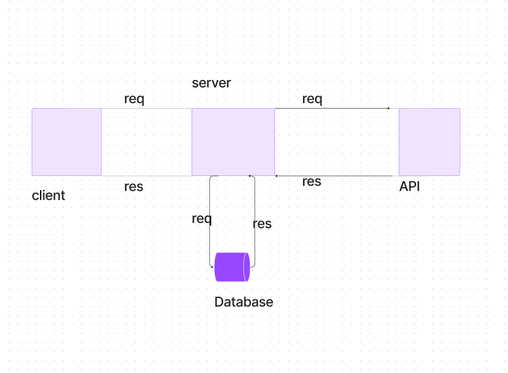

# Movies-Library
# Movies-Library - 1.0.0

**Author Name**: Samah Alsatary

## WRRC

## Overview
bulding server from zero
## Getting Started
<!-- What are the steps that a user must take in order to build this app on their own machine and get it running? -->
1-adding new movie
in the body of query you must add three key :id,title,overview which is varchar(225)
in the url of query you must add /addMovie

2-getting data from movie database at table movieInfo
in the url of query you must add /getMovie

## Project Features
<!-- What are the features included in you app -->
1-add home page handler
2-add fav page handler
3-add search handler
4-add trendeng handler
5-add add movie handler
6-add get movie handler
